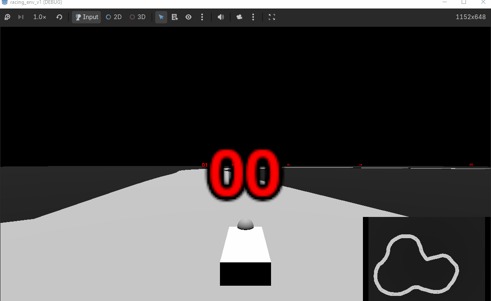
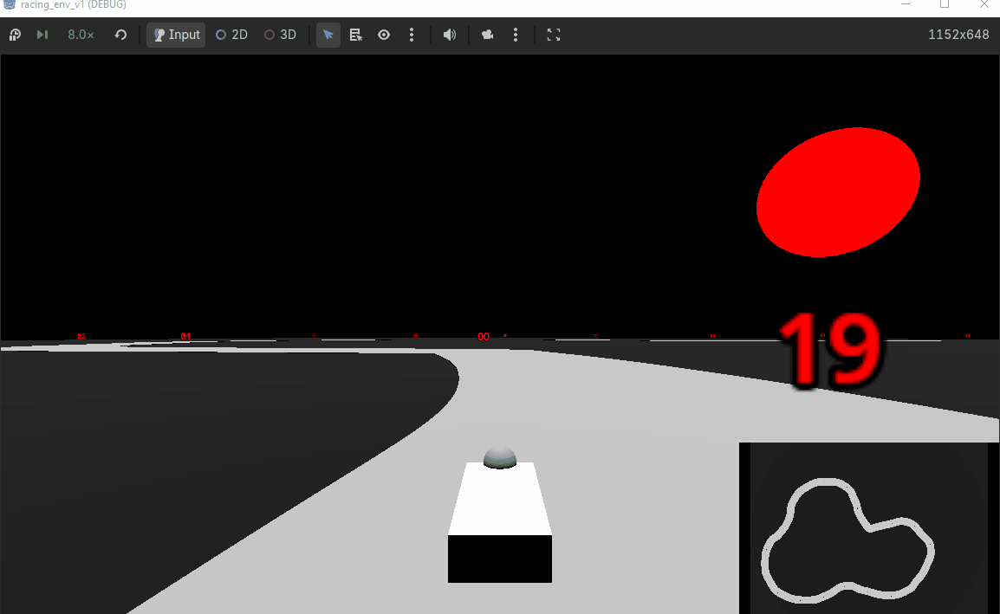

# GodotRLRacer

Goal is to create a racing agent w/ RL in a Godot Env

Godot handles the physics simulation, gdrl handles the RL + bridge between simulator and gym API

# Current Progress

Agent reward design in progress. Current agent drives sporadically then has long periods of inactivity.
 - Waypoint system in progress, still working on env. Demo below is human driven.

Human driven on left, agent learning on right in 4x speed
 - agent rewards: moving closer to next waypoint, using throttle
 - agent penalties: flipping the car over, moving off track, moving away from next waypoint

<div style="display: flex;">
  
  
</div>

# To Run

```
1. Pull this project
2. Download Godot 4.6.2
3. Import godot_projects/racing-env-v-1/project.godot using the Godot engine import menu
4. Hit Run in the editor
```

# Planned Next Steps

**Environment**
- facelift: lighting, meshes, level scenery
- parallelized environment (multiple cars in one level + creation of a project executable to pass to gdrl)
- add raycast sensors to car for RL observations

**RL**
- model selection, currently using gdrl default
- reward function creation
    - waypoints, turning penalty, gas penalty, time

# Waypoint generation

Waypoint generation is a mostly automated process to help expedite map creation

Paths are provided as (x,y,z) tuples in path_points/*.txt, and tools/generate_path.gd in the project turns them into a path3D + a CSGPolygon3D to provide the track w/ a mesh
 - non-parsable lines are skipped (lets us add comments)
 - the attached polygon can then be baked into a mesh (for human eyeballs) and a collision shape to keep track of whether the car's on the road
 - waypoint creation is done by sampling the curve at even intervals, first waypoint goes to first point in .txt