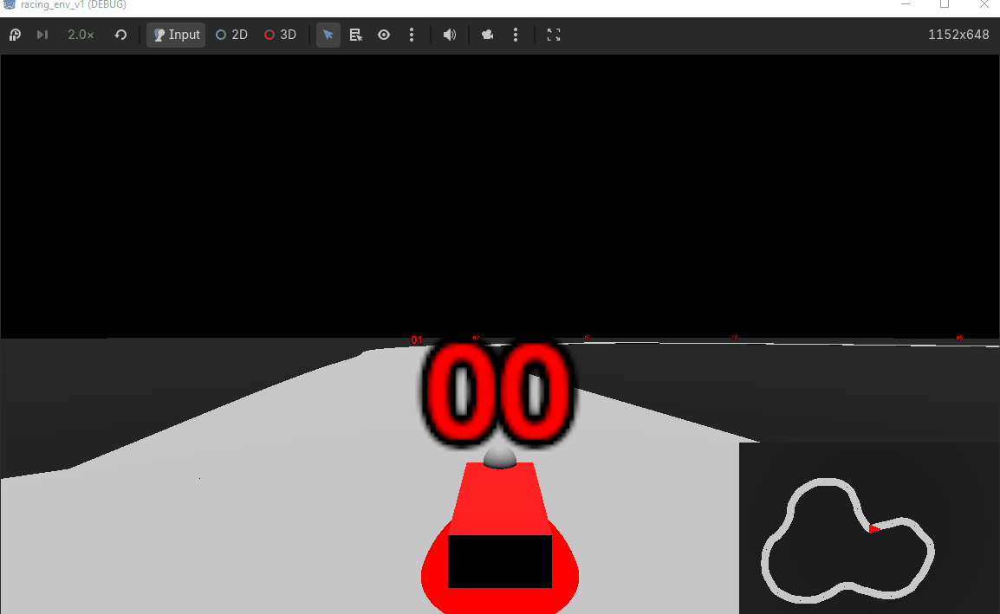

# GodotRLRacer

Goal is to create a racing agent w/ reinforcement learning in a Godot Env

Godot handles the physics simulation, gdrl handles the RL + bridge between simulator and gym API

# Current Progress

Working on agent reward design for smoother, faster driving

Human driving is currently smoother, but the agent learns the track decently in ~430 iterations across 500k steps
 - notice how the agent has really jerky movements, no penalty for steering or gas usage
 - agent rewards: moving closer to next waypoint, using throttle
 - agent penalties: flipping the car over, moving off track, moving away from next waypoint

<div style="display: flex;">
  <figure style="width: 50%; text-align: center;">
    
    <figcaption>Human Driven, 1x speed</figcaption>
  </figure>

  <figure style="width: 50%; text-align: center;">
    
    <figcaption>RL Racing Agent, 2x speed </figcaption>
  </figure>
</div>

# To play manually

```
1. Pull this project
2. Download Godot 4.6.2
3. Import godot_projects/racing-env-v-1/project.godot using the Godot engine import menu
4. Delete the Sync node in the Game scene
5. Hit Run in the editor
```

# Train + Inference

```
1. Run train.py then run the game
 - alternatively, export the game as an .exe and pass the path as a CLI arg for physics speedup
2. Once train is done, a `racer_ppo.zip will be made`, run inference.py to deploy your model onto the track
```

# Planned Next Steps

**Environment**
- facelift: lighting, meshes, level scenery
- tune raycast sensors, adjust spacing and amount
  - currently set to 100 meters max, heuristic march then bin search to get distance of car to road

**RL**
- model selection, currently using gdrl defaults
- reward function creation
    - waypoints, turning penalty, gas penalty, time

# Waypoint generation

Waypoint generation is a mostly automated process to help expedite map creation

Paths are provided as (x,y,z) tuples in path_points/*.txt, and tools/generate_path.gd in the project turns them into a path3D + a CSGPolygon3D to provide the track w/ a mesh
 - non-parsable lines are skipped (lets us add comments)
 - the attached polygon can then be baked into a mesh (for human eyeballs) and a collision shape to keep track of whether the car's on the road
 - waypoint creation is done by sampling the curve at even intervals, first waypoint goes to first point in .txt