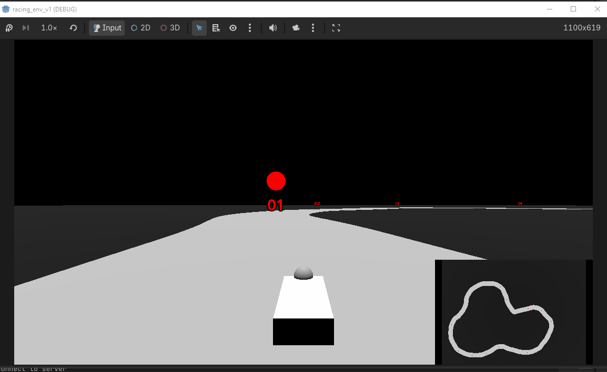

# Experiment Journal

Contains info from my runs + learnings, ordered from most recent to least

### 4/22/26 - Initial addition of lateral G-force penalty harms driving

Trying to get the car to drive smoothly + quickly between waypoints.

A couple additions have been added since the basic agent
- raycast sensors: the car can see how close the road is in 5 directions (up to 100m)
- continuous action space: steering + brake/throttle moved to [-1, 1] instead of {-1, 0, 1}
    - takes longer to converge but gives better performance

A lateral G-force loss was also applied to try and prevent the car from swerving
- calculated from the smoothed (15% lerp) lateral G-force * some small coef (0.002)
- if coef is too high, car stops turning completely

Coef 0.002 looks similar to 0, but 0.004 drives very waringly.
- 0.004 drives slower because lateral force is higher in a same radius turn for a higher speed
- however, we want the car to traverse the track quickly

<table style="width:80%">
  <tr>
    <th style="text-align:center">Lateral G-Force Penalty @ coef 0.004</th>
    <th style="text-align:center">Lateral G-Force Penalty @ coef 0.002</th>
    <th style="text-align:center">No Lateral G-Force Penalty</th>
  </tr>
  <tr>
    <td style="text-align:center"></td>
    <td style="text-align:center"></td>
    <td style="text-align:center"></td>
  </tr>
</table>

### 4/16/26 - Basic Agent can learn a track quickly

An agent was able to learn a simple track in 313 updates across 320k timesteps.
- Action space: discrete turn left/right, discrete brake/throttle
- Observation space: next two waypoints (x, y) relative to car
- Rewards: get close to waypoint (higher reward w/ more speed) + reach it
- Penalties: going off road, flipping the car, going away from a waypoint

The actions it can take are simple (discrete) and the target is clear as well (focus on waypoint). It swerves aggresively when driving as well.

A hyperparameter controls the amount of time the action has to be held down and we'll use this default value for future experiments (currently 8 frames, game runs at 60 fps).

