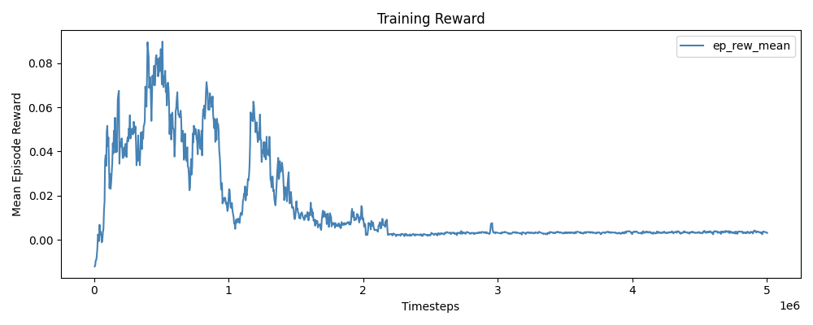
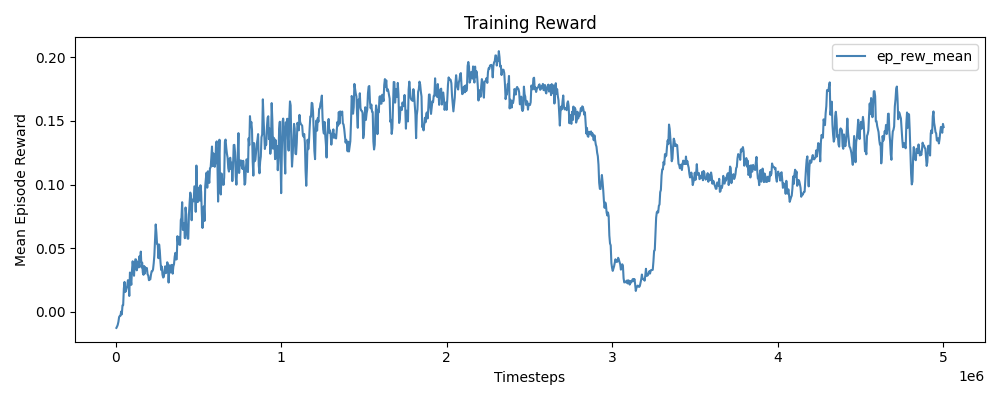
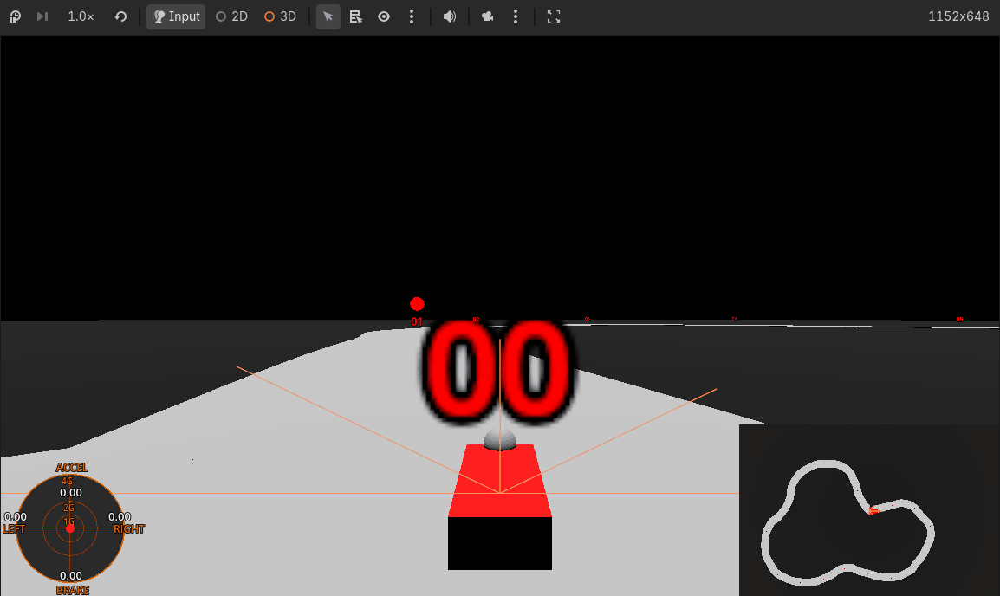
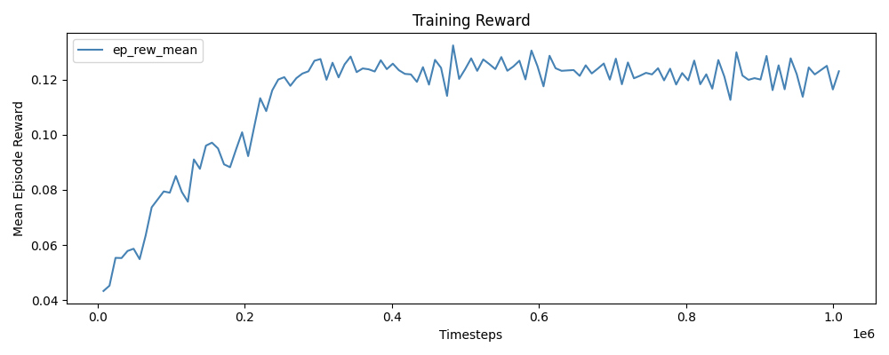
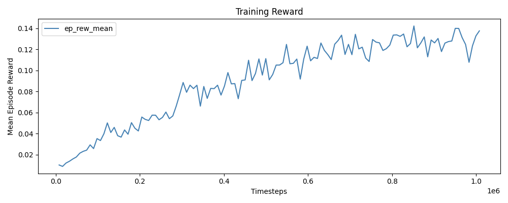

# Experiment Journal

Contains info from my runs + learnings, ordered from most recent to least

### 4/24/26 - Longer train w/ new config

Maybe we'll get better performance if we just train for longer?

I ran the train from 4/23 for 5M timesteps at a shorter rollout and saw that this resulted in a collapse from the mean episode reward plot. The train took an hour to complete and was done across 8 parallel envs at 16x sim speed. The reward config is currently: get close to waypoint, go fast, stay in road center. Problem is still phrased as single objective and not multi objective for simplicity.

Not every timestep gets a reward (controlled w/ n_steps which was 128), controlling the rollout buffer size + the PPO update hyperparameters is something I haven't touched much on yet as my focus has been reward design.

I tried to adjust this by lowering the penalty for going out of bounds from -1.0 to -0.1, reduced PPO epochs from 10 to 4, and increased the batch size for a less noisy gradient. This resulted in a more stable plot that didn't collapse.

The initial rise comes from the agent learning to drive, and the dip is exploration into a suboptimal territory. What's important here is that it recovers, although I'm unsure how we can tell whether it'll peak higher again w/o training for more timesteps, say 10M+.

### 4/23/26 - New reward config

Trying new approach where we reward the car for keeping it centered instead of getting closer to the waypoint.
 - explicitly reward desired behavior of centering car on track
 - forward motion rewarded by giving reward for **throttle**, same reward value of 1.0 for full throttle + centering

However, this results in a car that maxes throttle usage resulting in more swerving.

Changing the throttle reward to a log velocity reward doesn't fix this either. Both train plots seem to show convergence on rewards meaning that training for longer likely won't yield benefit.
- the velocity reward does show some more juice, it's noisy but might not have converged

My current goal is to get it to follow a cleaner line w/ less swerving.

<table style="width:75%">
  <tr>
    <th style="text-align:center">Agent Sim w/ Throttle + Centering reward</th>
    <th style="text-align:center">Agent Sim w/ Log Velocity + Centering reward</th>
  </tr>
  <tr>
    <td style="text-align:center"></td>
    <td style="text-align:center"></td>
  </tr>
</table>

<table style="width:75%">
  <tr>
    <th style="text-align:center">Reward Plot for Agent Sim w/ Throttle + Centering reward</th>
    <th style="text-align:center">Reward Plot for Agent Sim w/ Log Velocity + Centering reward</th>
  </tr>
  <tr>
    <td style="text-align:center"></td>
    <td style="text-align:center"></td>
  </tr>
</table>

### 4/22/26 - Initial addition of lateral G-force penalty harms driving

Trying to get the car to drive smoothly + quickly between waypoints.

A couple additions have been added since the basic agent
- raycast sensors: the car can see how close the road is in 5 directions (up to 100m)
- continuous action space: steering + brake/throttle moved to [-1, 1] instead of {-1, 0, 1}
    - takes longer to converge but gives better performance

A lateral G-force loss was also applied to try and prevent the car from swerving
- calculated from the smoothed (15% lerp) lateral G-force * some small coef (0.002)
- if coef is too high, car stops turning completely

Coef 0.002 looks similar to 0, but 0.004 drives very waringly.
- 0.004 drives slower because lateral force is higher in a same radius turn for a higher speed
- however, we want the car to traverse the track quickly

<table style="width:75%">
  <tr>
    <th style="text-align:center">Lateral G-Force Penalty @ coef 0.004</th>
    <th style="text-align:center">Lateral G-Force Penalty @ coef 0.002</th>
    <th style="text-align:center">No Lateral G-Force Penalty</th>
  </tr>
  <tr>
    <td style="text-align:center"></td>
    <td style="text-align:center"></td>
    <td style="text-align:center"></td>
  </tr>
</table>

### 4/16/26 - Basic Agent can learn a track quickly

An agent was able to learn a simple track in 313 updates across 320k timesteps.
- Action space: discrete turn left/right, discrete brake/throttle
- Observation space: next two waypoints (x, y) relative to car
- Rewards: get close to waypoint (higher reward w/ more speed) + reach it
- Penalties: going off road, flipping the car, going away from a waypoint

The actions it can take are simple (discrete) and the target is clear as well (focus on waypoint). It swerves aggresively when driving as well.

A hyperparameter controls the amount of time the action has to be held down and we'll use this default value for future experiments (currently 8 frames, game runs at 60 fps).

