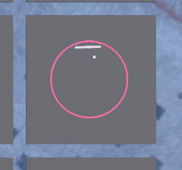

### Overview

Following guide at

https://github.com/edbeeching/godot_rl_agents/blob/main/docs/CUSTOM_ENV.md

Godot version: v4.1.stable.mono.official [970459615]

RL Plugin needs to be manually added from here

https://github.com/edbeeching/godot_rl_agents

Doesn't show up in asset store

Open project.godot and follow the guide to get started

### Thoughts on implementation

Guide isn't fully clear that the Sync node in the inherit for the Train scene isn't obviously from RL proj
 - looks like a regular node, just called Sync
 - need to expand it's script to find the parent owner

Unclear how to save an agent/exit cleanly after, might not be a part of guide

### Agent Behavior Observation

After ~100 iterations, the agent seems to have decent ability to hit the ball w/ the paddle but prioritizes small hits

This isn't really what the objective of ring pong is, to motivate better behavior, a reward for the ball crossing over the middle or going towards the center should probably be implemented

I interpret this behavior as the reward function strongly controlling what the task actually is.
 - task here isn't actually to bounce the ball around in the ring (this is vague)
 - task is to hit ball as many times as possible

